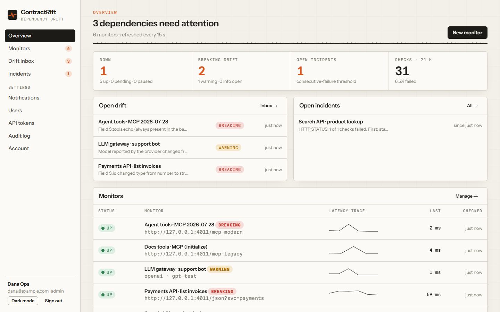
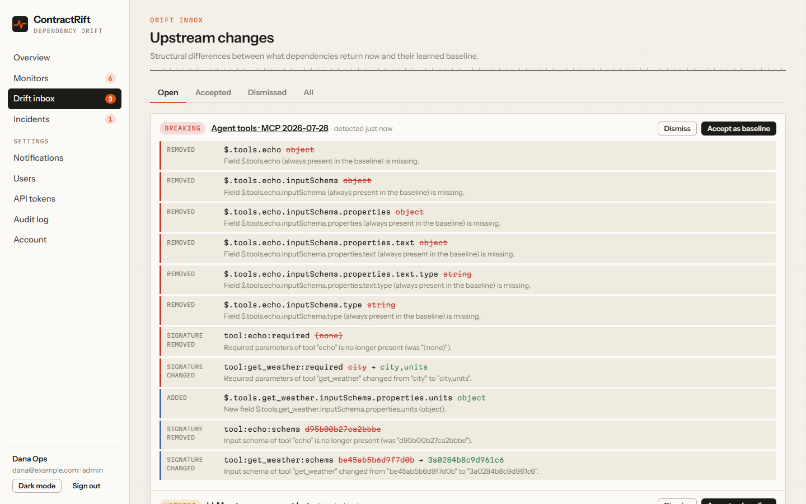
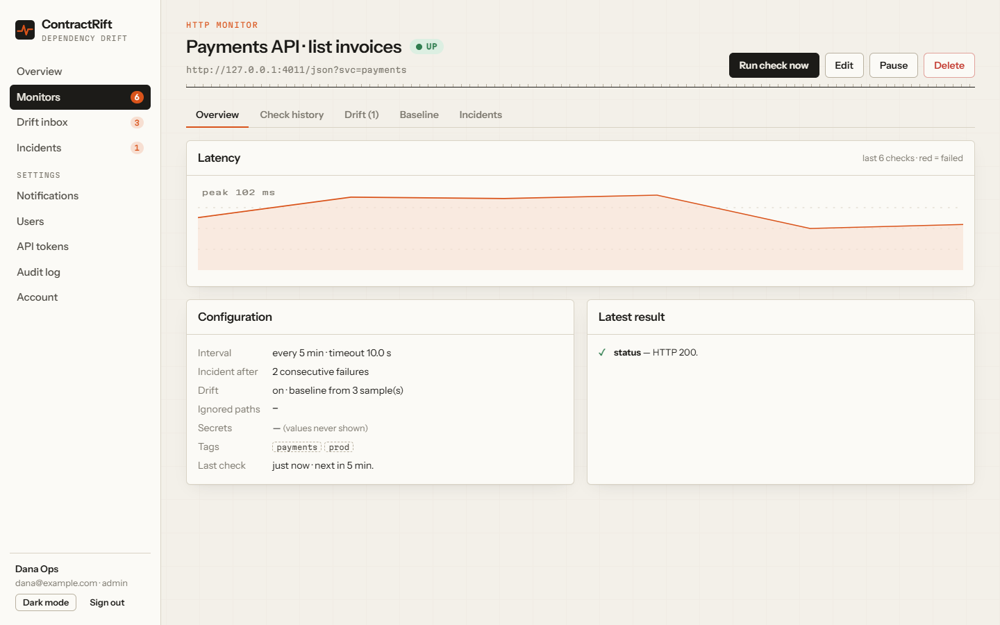

<p align="center">
  
</p>

<h1 align="center">ContractRift</h1>

<p align="center">
  <strong>Know when the APIs, LLMs and MCP servers you depend on go down — or silently change.</strong><br />
  Self-hosted · open source · your API keys never leave your servers.
</p>

<p align="center">
  <a href="https://github.com/ahmedgcompany-cyber/contractrift/actions/workflows/ci.yml"></a>
  <a href="https://github.com/ahmedgcompany-cyber/contractrift/releases"></a>
  <a href="LICENSE"></a>
  <a href="https://github.com/ahmedgcompany-cyber/contractrift/pkgs/container/contractrift"></a>
</p>

<p align="center">
  <a href="https://136-119-147-140.sslip.io"><strong>Live demo</strong></a> ·
  <a href="https://ahmedgcompany-cyber.github.io/contractrift/">Website</a> ·
  <a href="#quick-start">Quick start</a> ·
  <a href="USER_GUIDE.md">User guide</a> ·
  <a href="API_DOCUMENTATION.md">API</a> ·
  <a href="ROADMAP.md">Roadmap</a>
</p>



> **Try it:** [https://136-119-147-140.sslip.io](https://136-119-147-140.sslip.io) — read-only demo account shown on the sign-in page, watching the real GitHub API and two public MCP servers.

## Why

Third-party APIs change without you changing anything. A field disappears, a type changes, validation
tightens, an LLM alias moves to a new model, an MCP server drops a tool. Unit tests use frozen mocks,
integration tests run only on pull requests, and uptime monitors only see `200 OK`. Teams find out from customers.

The monitoring tools that do catch this are SaaS products that need your production API keys.
**ContractRift runs on your infrastructure** and watches the _contract_, not just the status code.

## What it does

|                        |                                                                                                                                                                                                               |
| ---------------------- | ------------------------------------------------------------------------------------------------------------------------------------------------------------------------------------------------------------- |
| **REST / JSON APIs**   | Learns the response structure from scheduled probes. Removed or re-typed fields → **breaking**; newly-null → **warning**; new fields → **info**. Plus status, latency, JSONPath and JSON Schema assertions.   |
| **LLM APIs**           | OpenAI-compatible (Chat Completions) and Anthropic (Messages). Detects when the provider reports a **different model** behind your alias, and when output checks (contains, regex, JSON Schema) stop passing. |
| **MCP servers**        | Streamable HTTP, both the **2026-07-28 stateless** protocol and initialize-based servers (auto-detected). Detects removed tools, **new required parameters**, failing tool calls.                             |
| **Drift inbox**        | Every change with path, before → after and severity. **Accept** (baseline updates) or **dismiss** (mute that change).                                                                                         |
| **Incidents & alerts** | Incident after N consecutive failures; HMAC-signed webhooks and Slack with retries and a delivery log.                                                                                                        |
| **CI deploy gate**     | `node scripts/contractrift-gate.mjs --tags payments` exits non-zero while a dependency is down or has unreviewed breaking drift.                                                                              |
| **Teams & security**   | Viewer / editor / admin roles, read-only API tokens, audit log, AES-256-GCM encrypted write-only secrets with key rotation, secret URL parameters, SSRF protection, CSP.                                      |

<table>
  <tr>
    <td></td>
    <td></td>
  </tr>
</table>

## Quick start

**Docker** (embedded PostgreSQL, data in a volume):

```bash
docker run -d --name contractrift -p 3000:3000 -v contractrift:/data \
  -e ENCRYPTION_KEY="$(openssl rand -base64 32)" \
  ghcr.io/ahmedgcompany-cyber/contractrift:latest
```

Open http://localhost:3000 and create the admin account. Keep the `ENCRYPTION_KEY` value (it encrypts stored
API keys). For anything other than `localhost` over plain HTTP, put it behind HTTPS or add `-e COOKIE_SECURE=false`.

**Docker Compose with PostgreSQL 17:** `cp .env.example .env`, set `ENCRYPTION_KEY` and `POSTGRES_PASSWORD`, then
`docker compose up -d --build`.

**One-click cloud:**

<a href="https://render.com/deploy?repo=https://github.com/ahmedgcompany-cyber/contractrift"></a>

**From source** (Node.js 22.12+):

```bash
npm ci
cp .env.example .env && npm run gen-key   # paste the key into ENCRYPTION_KEY
npm run build && npm start
```

Try it with no real credentials using the bundled fake upstreams:

```bash
npm run upstreams -w backend              # fake JSON, OpenAI/Anthropic-format and MCP servers on :4010
# set ALLOW_PRIVATE_TARGETS=true in .env, then:
npm run seed:demo -w backend -- --upstreams http://127.0.0.1:4010
```

## Status

**v0.3.0 — functional, tested MVP.** 146 unit/integration tests (on embedded PGlite and on PostgreSQL 17 in
CI), 11 browser E2E tests, the docker-compose stack exercised in CI, and probes live-tested against the GitHub
API, two real MCP servers (DeepWiki, Hugging Face) and a real OpenAI-compatible LLM server. Not yet load-tested.
Full, honest status: [PROJECT_STATUS.md](PROJECT_STATUS.md).

## Documentation

| Document                                                                                                                                                                              | Purpose                                                           |
| ------------------------------------------------------------------------------------------------------------------------------------------------------------------------------------- | ----------------------------------------------------------------- |
| [INSTALLATION.md](INSTALLATION.md)                                                                                                                                                    | Install and first run                                             |
| [USER_GUIDE.md](USER_GUIDE.md)                                                                                                                                                        | Using the product                                                 |
| [DEPLOYMENT.md](DEPLOYMENT.md)                                                                                                                                                        | Docker, PostgreSQL, Render, reverse proxy, key rotation, upgrades |
| [API_DOCUMENTATION.md](API_DOCUMENTATION.md) · [api/openapi.yaml](api/openapi.yaml)                                                                                                   | HTTP API                                                          |
| [ARCHITECTURE.md](ARCHITECTURE.md) · [DATABASE.md](DATABASE.md)                                                                                                                       | Design                                                            |
| [DEVELOPER_GUIDE.md](DEVELOPER_GUIDE.md) · [CONTRIBUTING.md](CONTRIBUTING.md) · [AI_DEVELOPMENT_CONTEXT.md](AI_DEVELOPMENT_CONTEXT.md) · [CLAUDE_CODE_GUIDE.md](CLAUDE_CODE_GUIDE.md) | Working on the code                                               |
| [SECURITY.md](SECURITY.md) · [TROUBLESHOOTING.md](TROUBLESHOOTING.md)                                                                                                                 | Operations                                                        |
| [PRODUCT_SPEC.md](PRODUCT_SPEC.md) · [ROADMAP.md](ROADMAP.md) · [research/](research/)                                                                                                | Product and research                                              |
| [PROJECT_STATUS.md](PROJECT_STATUS.md) · [CHANGELOG.md](CHANGELOG.md)                                                                                                                 | Status                                                            |

## Tech

TypeScript · Node.js 24 · Fastify 5 · Drizzle ORM · PostgreSQL / PGlite · React 19 · Vite · TanStack Query ·
Vitest · Playwright.

## License

ContractRift is **dual-licensed**:

- **Open source:** [GNU AGPL-3.0](LICENSE). Free to use, modify and self-host. If you offer a modified
  version as a network service, you must publish your changes under the same license.
- **Commercial license:** for organizations that cannot use AGPL software or want to embed or
  resell ContractRift without its obligations. See [COMMERCIAL_LICENSE.md](COMMERCIAL_LICENSE.md).
